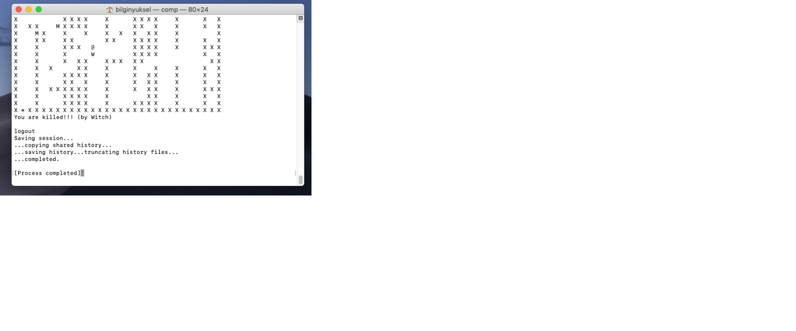

# EscapeFromMaze
Escape from maze console game. Multithread, keylistener and signals used.


<h3>Screen Photo</h3>
<p align="center">

  </p>
There two monsters doing same thing all the time updown monster and right left monster.Same working mechanism for each 
if you see wall go left or if you see wall go right.Same for updown monster. <br>
And the real monster(SLEEEEEEPY MONSTER) knows your location if you close enough to him he will wake up and start to chase you!!!<br>
By the way he knows your location with euclide distance calculation. You can walk on the map with W-A-S-D keys you don't have to enter when you hit the key because we have key listener. 4 threads working on this program 1 for user activities 1 for RLMonster 1 for UPMonster 1 one for control. Control checks if user close enough to monster or not, if user close enough to monster control thread closing and new sleeeeepy monster thread activates.Done !. You know that but if you reach exit you will win the game...


```shell
If you use MacOS
>> gcc mazeEscape.c -o game
>> ./game
If you use Linux
>> gcc mazeEscape.c -o game -lm -lpthread
>> ./game
```
